## 🖥️ CSE Student | 🎨 Drawing Artsist 
I learn code because I just do it, i do Python, Java, Javascript and C++  
I really hate React especially you ReactJS.  
I can draw and translate English to Indonesian and Japanese too.  
I also learn code with CS50 Havard, freecodecamp, and W3School.

###

  
  

